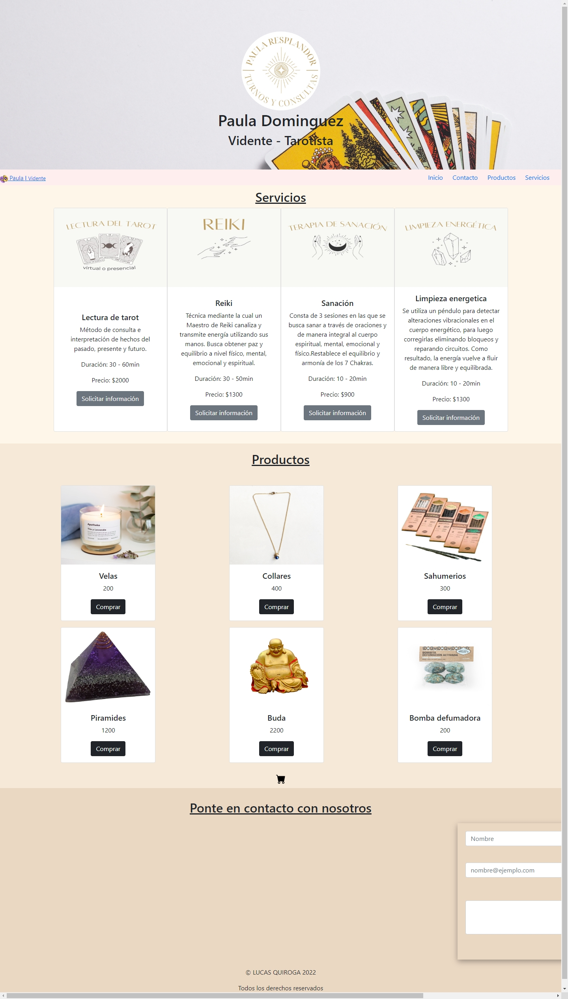

# Proyecto-Final-JS

Proyecto final del curso de JavaScript de Coder House - 2022

## Preview image 👁

## Deployment 📦

- [DEMO](https://monumental-queijadas-3be5e4.netlify.app/) - Website

## Technologies Used

- HTML/CSS
- Javascript

## Authors ✒️

- **Lucas Quiroga** - _Initial work_ - [Lucas Quiroga](https://github.com/Lucas-Quiroga)

## License 📄

This project is licensed © LUCAS QUIROGA 2022, all rights reserved.
